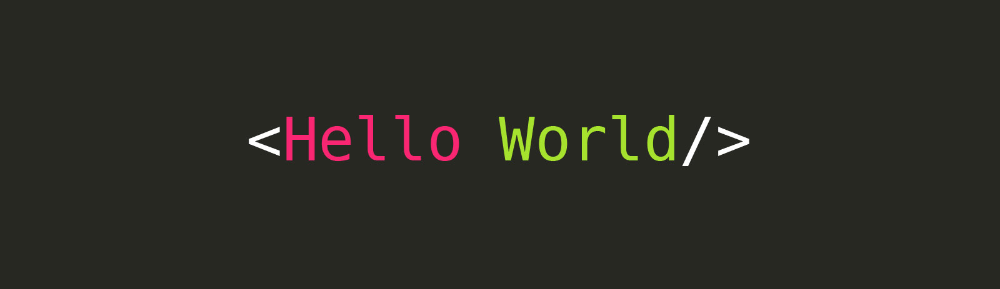

\

\# Hi, I'm Matias Strficek 👋
\
### Full-Stack Software Engineer | TypeScript · React · Angular · Node.js\

I'm a Full-Stack Developer focused on building scalable web applications, real-time systems and user-centered products.

My experience spans both **frontend and backend development**, working with modern TypeScript ecosystems and contributing to production applications involving authentication, real-time communication, notifications, payments, cloud infrastructure and complex business logic.

I enjoy understanding how systems work beyond the UI — from frontend architecture and state management to APIs, databases, infrastructure and application design.

\<h4 align="left">\<b>\<i>Find me at:\</i>\</b>\</h4>
\

&#x20;\<a href="https\://www\.linkedin.com/in/matias-strficek-68a203142/" target="blank">
&#x20; \\</a>
&#x20;\<b>\<i> LinkedIn Profile\</i>\</b>
\

\

&#x20;\<a href="https\://matiasstrficek.vercel.app/" target="blank">
&#x20;\<b>\<i>🌐 Portfolio\</i>\</b>
&#x20;\</a>
\

\## 🚀 Technologies

\<h3 align="center">Frontend\</h3>

\

&#x20;   \<a href="https\://www\.typescriptlang.org/">\\</a>
&#x20;   \<a href="https\://developer.mozilla.org/en-US/docs/Web/JavaScript">\\</a>
&#x20;   \<a href="https\://react.dev/">\\</a>
&#x20;   \<a href="https\://nextjs.org/">\\</a>
&#x20;   \<a href="https\://angular.dev/">\\</a>
&#x20;   \<a href="https\://vuejs.org/">\\</a>
&#x20;   \<a href="https\://tailwindcss.com/">\\</a>
\

\<h3 align="center">Backend & Databases\</h3>

\

&#x20;   \<a href="https\://nodejs.org/">\\</a>
&#x20;   \<a href="https\://nestjs.com/">\\</a>
&#x20;   \<a href="https\://expressjs.com/">\\</a>
&#x20;   \<a href="https\://www\.postgresql.org/">\\</a>
&#x20;   \<a href="https\://www\.mongodb.com/">\\</a>
&#x20;   \<a href="https\://redis.io/">\\</a>
&#x20;   \<a href="https\://firebase.google.com/">\\</a>
\

\<h3 align="center">Cloud & Tools\</h3>

\

&#x20;   \<a href="https\://aws.amazon.com/">\\</a>
&#x20;   \<a href="https\://cloud.google.com/">\\</a>
&#x20;   \<a href="https\://git-scm.com/">\\</a>
&#x20;   \<a href="https\://github.com/">\\</a>
&#x20;   \<a href="https\://www\.postman.com/">\\</a>
\

\## 💼 Professional Experience

\### FXReplay — Web Developer

Working on a production trading platform using **Angular, TypeScript and Node.js**, contributing to both frontend features and backend integrations.

Some of the systems I've worked on include:
\
- Real-time chat interfaces and communication features\
- Friends, blocking and user relationship systems\
- Notification systems with unread states and real-time alerts\
- Match and rematch flows\
- Ranking and ELO visualization\
- Backend Cloud Functions and APIs\
- Redis-backed real-time infrastructure\
- Reusable Angular component architecture

\### Model to Go — Full-Stack Developer

Developed and maintained a multi-role platform connecting **models, agencies, photographers, operators and administrators**.

Worked across the entire stack with **Next.js, TypeScript, NestJS, Firebase and Google Cloud**.

Key areas included:
\
- Role-based authentication and authorization\
- Real-time messaging with Socket.IO\
- Notification systems\
- Stripe subscriptions and payment flows\
- Campaign and announcement systems\
- Advanced search and filtering\
- Admin and operator dashboards\
- Dynamic portfolio subdomains\
- Cloud deployment and infrastructure

\### Data-ka — Frontend / Full-Stack Developer

Worked on frontend development and application modernization using **Vue.js, Nuxt.js, React and Next.js**.

Contributed to:
\
- Migration from Vue/Nuxt applications to Next.js\
- Reusable UI components\
- Responsive interfaces\
- API integrations\
- Forms and validation\
- Performance and UX improvements

\## 🧠 Currently Exploring

I'm currently learning and experimenting with:
\
- Large Language Models\
- Retrieval-Augmented Generation \(RAG\)\
- Vector databases\
- Embeddings and semantic search\
- Prompt engineering\
- AI agents and tool calling\
- LLM evaluation and observability\
- Distributed and event-driven architectures

\## 🧪 Featured Project — ContextForge

A platform I'm building to explore and understand **LLM systems end-to-end**.

The goal is to make the entire AI pipeline observable, including:

`Documents → Chunking → Embeddings → Retrieval → Prompt → LLM → Evaluation`

Built around:

**Next.js · NestJS · PostgreSQL · Qdrant · Ollama**

The project is designed as a playground for experimenting with RAG pipelines, retrieval strategies, prompt optimization, agents, reranking, caching and evaluation.

\## 🎯 What I enjoy building
\
- Complex frontend applications\
- Real-time communication systems\
- Backend and API architecture\
- Authentication and authorization\
- Notification systems\
- SaaS platforms\
- AI-powered applications\
- Developer tooling

\## 📫 Contact

📧Email: [matias.strficek@gmail.com](mailto:matias.strficek@gmail.com)

🔗LinkedIn: [Matias Strficek](https\://www\.linkedin.com/in/matias-strficek-68a203142/)

🌐Portfolio: [matiasstrficek.vercel.app](https\://matiasstrficek.vercel.app/)\
